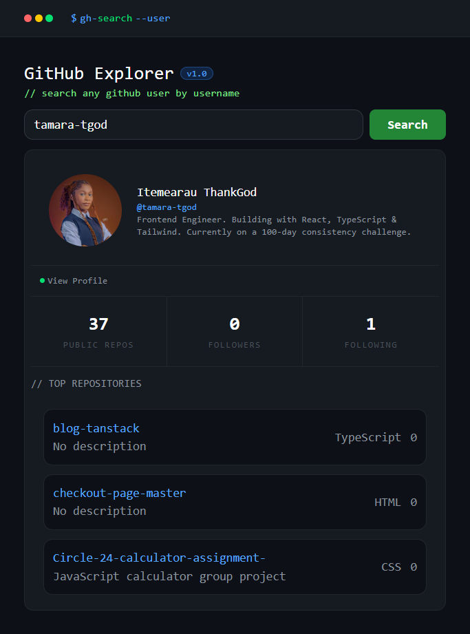

# GitHub Explorer 🔍

> Search any GitHub user by username and explore their profile, stats, and top repositories.

## Live Demo
🌐 [github-explorer-ten-mocha.vercel.app](https://github-explorer-ten-mocha.vercel.app/)

---

## Features

- Search any GitHub user by username
- View profile — avatar, name, bio and handle
- See public repos, followers and following count
- Browse top repositories with language and star count
- Handles errors gracefully — empty input, invalid usernames
- Fetches user and repos simultaneously with `Promise.all`

---

## Tech Stack

- **React** — UI library
- **TypeScript** — type safety throughout
- **Tailwind CSS v4** — styling
- **Vite** — build tool
- **GitHub REST API** — data source

---

## Getting Started

```bash
# Clone the repository
git clone https://github.com/Tamara-tgod/github-explorer.git

# Navigate into the project
cd github-explorer

# Install dependencies
npm install

# Start the development server
npm run dev
```

---

## Project Structure

```
src/
├── component/
│   └── Topbar.tsx        # Terminal header bar
├── types.ts              # TypeScript interfaces
├── App.tsx               # Main application component
└── index.css             # Global styles + Tailwind theme
```

---

## TypeScript Highlights

This project was built as part of a structured TypeScript learning roadmap. Key patterns used:

- **Interfaces** for typing GitHub API responses (`GitHubUser`, `GitHubRepo`)
- **Generics** with `useState<GitHubUser | null>`
- **Async/await** with typed `Promise` return types
- **Optional properties** for fields that may not exist on every user
- **Type narrowing** with `instanceof Error` in catch blocks

---

## Screenshots



---

## Author

**Itemearau ThankGod** — [@Tamara-tgod](https://github.com/Tamara-tgod)

Built during a 100-day coding consistency challenge.